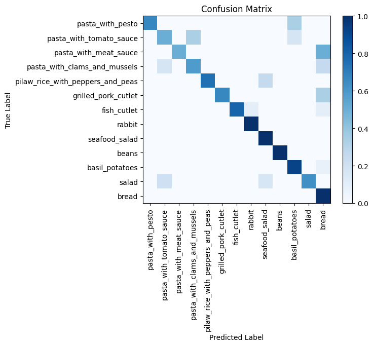

# ResNet Finetuning for Image Classification

## Introduction
The task proposed is image classification.  
Starting from a list of 13 foods categories, the goal is to classify images of food in the correct category.
The input images are meant to be already segmented and wiht a white background.    

It is possible to take a look at the notebook for understanding the architecture and the training process.  
For the dataset Creation take a look at the python files.  

## Dataset
The dataset creation underwent multiple iterations, leading to better and better performances.
The leading idea was to input a segmented image and output an array of probabilities-alike values for each and every food category.
   

Above is an example of image prediction.  
The issue was indeed to find and collect images that resembled somewhat the test set, still retaining generality and avoiding overfitting.  
To do so the final dataset was assembled as follows:
1. Find Google Images query that resembled the categories requested, downloading each and every image in the query (around 700 per class).
2. Filter out unrelated images or deceptive samples (retaining 90-280 images per class).
3. Manually crop each image in such a way that the food is the main object of the photo.
4. Artificially boost the number of samples to 301 images per class by applying random affine transformations and flipping to the original images.
The final dataset can be found [here](https://drive.google.com/file/d/1DRkbSDNGjNl5fNdGbw4l4hmzCFtvtw6v/view)
 
Each iteration corresponds to an enhancement in the model’s performance (see evaluation for numerical results).

## Model Architecture and Training
The final model was based on ResNet34. Even though SotA results are performed usually with ResNet50, such a model is far too complex for a small classification task with just 13 total labels. In order to avoid overfitting it was used a smaller instance coupled with a final fully connected two layer for classification purposes.  
Specifically, only the last layer of ResNet34 and the classification layer were actually fine tuned. The probabilities-alike values were computed with softmax on the embeddings of the last classification layer.  
To further avoid overfitting and making the overall model more robust, dropout normalization was used during training.
   

Training was done with 8 epochs, using the Cross Entropy Loss and a learning rate of 3e-5.  
Such parameters were found to be optimal by trial and error.    

The model was eventually tested on the test set, and finally exported to a suitable format for importing it in C++ through the libtorch library.  
Have a look at the python notebook used for training here.

## Evaluation
To better understand the model’s performances and decide whether to update the current version or not three main metrics were mainly used:  
* Accuracy: The accuracy computed as # true label is the most probable# samples in the testing  set was the main metric. Such a score is important to correctly classify foods.
* Average Position: Introducing the average position per label as the average rank of the true prediction, the average position is the average position across all labels. The lower it is the less uncertain the model is towards the true class.
* Confusion matrix: The confusion matrix was a clear representation of the model difficulties and strengths.

| Dataset | Accuracy | Average Position |
| --- | --- | --- |
| Raw | 0.679 | 1.91 |
| Filtered | 0.723 | 2.04 |
| Cropped and Augmented | 0.795 | 1.55 |

The final model was able to achieve an accuracy of 0.795 and an average position of 1.55.    

The confusion matrix for the final model is shown below.  

The model clearly well understood the task and how to solve it. Even though an accuracy of 0.8 is not comparable with SotA results, still given the fact that the training set was sampled from the internet the results were far more than what we expected.  